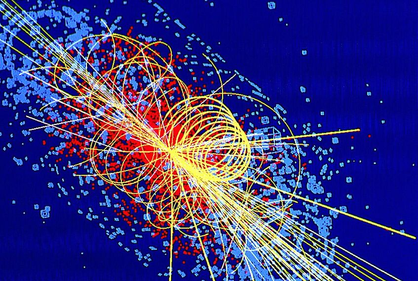
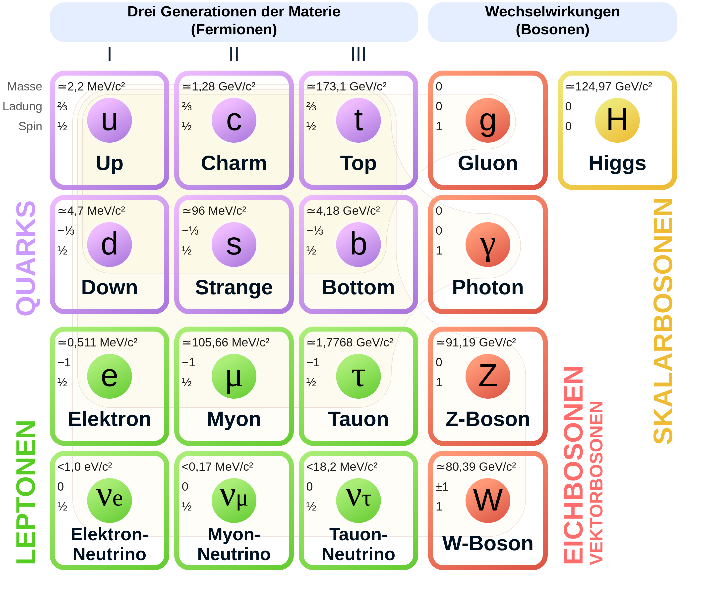
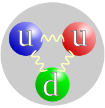
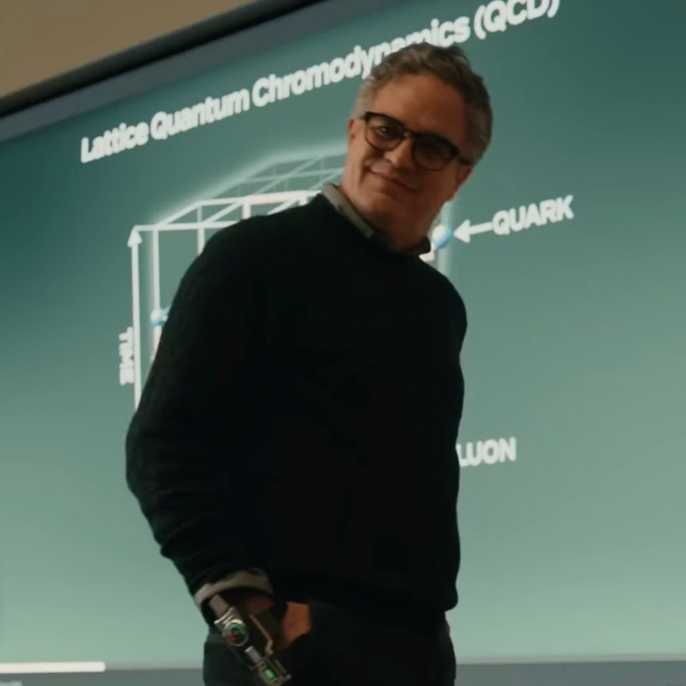
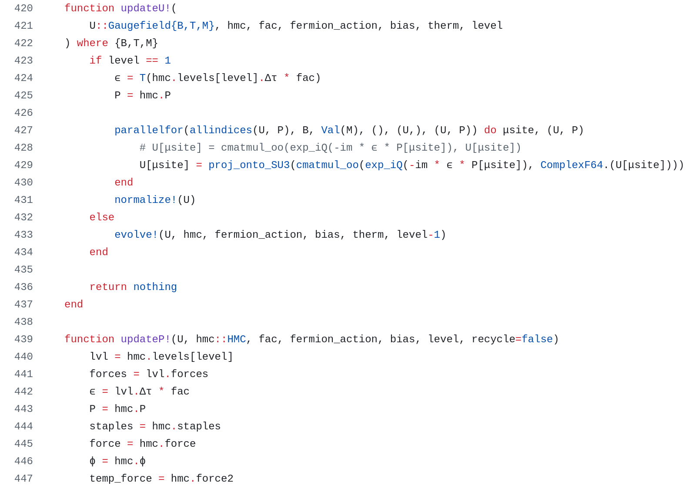
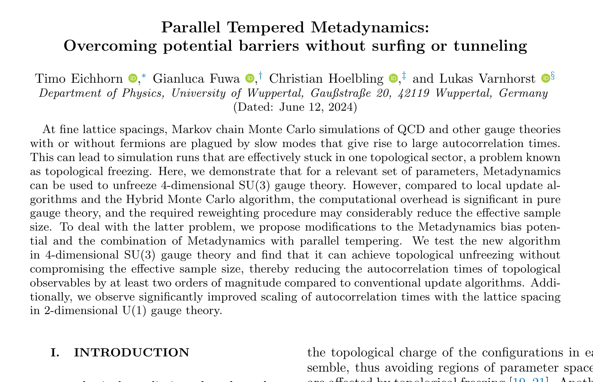

## Warum Teilchenphysik?

::: {.notes}
Kurz vorstellen: Name, Promotion, warum ich Physik mache.
:::


:::: {.columns}

::: {.column width="55%"}

- Woraus besteht die Welt wirklich?
- Warum haben Teilchen Masse?
- Was hält Protonen & Neutronen zusammen?
- Lassen sich mathematische Formeln zur Beschreibung der Natur finden?

:::

::: {.column width="45%"}
{width=100%}
:::

::::

::: {.notes}
Alltagsbezug herstellen, Neugier wecken.
:::

<!-- ## Appendix {.appendix} -->
<!---->
<!-- Um physikalische Theorien überprüfen zu können, müssen mithilfe dieser experimentell -->
<!-- nachweisbare Vorhersagen berechnet werden. In vielen Fällen ist die Theorie jedoch so -->
<!-- kompliziert, dass keine Rechnungen mehr mit Blatt und Papier oder gar einem Taschenrechner -->
<!-- durchführbar sind. Eine der fundamentalsten Theorien in dieser Kategorie ist die -->
<!-- Quantenchromodynamik (QCD), die unter anderem dafür zuständig ist, Atomkerne zusammenzuhalten. -->
<!-- Wir schauen uns an, wie Teilchenphysiker die Raumzeit zu einem Gitternetz umwandeln, -->
<!-- um die starke Kernkraft am Supercomputer zu simulieren und an welchen Problemen aktiv gearbeitet -->
<!-- wird. -->

## Das Standardmodell (Überblick)

<!-- Alle bekannten Elementarteilchen -->

::: {.center}
{width=63%}
:::
<!-- | Fermionen (Materie) |  |  | Bosonen (Kräfte) |  | -->
<!-- |:---:|:---:|:---:|:---:|:---:| -->
<!-- | **[up (u)]{style="color:#d9534f; font-weight:bold;"}** | **[charm (c)]{style="color:#d9534f; font-weight:bold;"}** | **[Elektron (e)]{style="color:#5bc0de; font-weight:bold;"}**<br> **[Elektronneutrino (νₑ)]{style="color:#5bc0de; font-weight:bold;"}** | **[Photon (γ)]{style="color:#5cb85c; font-weight:bold;"}** | **Higgs (H)** | -->
<!-- | **[down (d)]{style="color:#d9534f; font-weight:bold;"}** | **[top (t)]{style="color:#d9534f; font-weight:bold;"}** | **[Muon (μ)]{style="color:#5bc0de; font-weight:bold;"}**<br>  **[Muonneutrino (ν~μ~)]{style="color:#5bc0de; font-weight:bold;"}**| **[W±]{style="color:#5cb85c; font-weight:bold;"}** | **[Z]{style="color:#5cb85c; font-weight:bold;"}** | -->
<!-- | **[strange (s)]{style="color:#d9534f; font-weight:bold;"}** | **[bottom (b)]{style="color:#d9534f; font-weight:bold;"}** | **[Tau (τ)]{style="color:#5bc0de; font-weight:bold;"}**<br> **[Tauneutrino (ν~τ~)]{style="color:#5bc0de; font-weight:bold;"}** | **[Gluon (g)]{style="color:#5cb85c; font-weight:bold;"}** |  | -->
<!---->
<!-- ::: {.smaller} -->
<!-- [■]{style="color:#d9534f; font-weight:bold;"} Quarks  -->
<!-- [■]{style="color:#5bc0de; font-weight:bold;"} Leptonen  -->
<!-- [■]{style="color:#5cb85c; font-weight:bold;"} Kraftbosonen  -->
<!-- [■]{style="color:#f0ad4e; font-weight:bold;"} Higgs -->
<!-- ::: -->

::: {.notes}
Betonung: Alles, was wir kennen. Fokus gleich auf Quarks & Gluonen lenken → QCD.
:::

## Die starke Wechselwirkung

:::: {.columns}

::: {.column width="45%"}

- Beschrieben durch: **QCD** (Quantenchromodynamik)
- Quarks tragen *Farbladung*
- Vermittelt durch Gluonen
- Verantwortlich für ~99% der Masse sichtbarer Materie

:::

::: {.column width="45%"}

<!-- ```{=html} -->
<!-- <div style="text-align: center; margin: 2em 0;"> -->
<!--   <svg width="500" height="500" viewBox="0 0 500 500" xmlns="http://www.w3.org/2000/svg"> -->
<!--     <defs> -->
<!--       <filter id="glow" x="-20%" y="-20%" width="140%" height="140%"> -->
<!--         <feGaussianBlur stdDeviation="4" result="blur" /> -->
<!--         <feMerge> -->
<!--           <feMergeNode in="blur" /> -->
<!--           <feMergeNode in="SourceGraphic" /> -->
<!--         </feMerge> -->
<!--       </filter> -->
<!--     </defs> -->
<!---->
<!--     <g filter="url(#glow)" stroke="black" stroke-width="3" stroke-linejoin="round"> -->
<!--       <circle cx="359" cy="300" r="80" fill="#0000ff" /> -->
<!--       <circle cx="141" cy="300" r="80" fill="#00ff00" /> -->
<!--       <circle cx="250" cy="100" r="80" fill="#ff0000" /> -->
<!--     </g> -->
<!---->
<!--   </svg> -->
<!-- </div> -->
<!-- ``` -->
{width=100%}
:::

::::

::: {.notes}
Farbe als Analogie, keine echte Farbe.
:::

## Das Problem

:::{.fragment}
QCD-Gleichungen sind bekannt …
:::

:::{.fragment}
**… aber extrem schwer zu lösen!**
:::

. . .

<br/> Warum?

## Klassische Physik vs. Quantenphysik {auto-animate=true}

::: {data-id="path" auto-animate-delay="0"}
```{=html}
<svg width="700" height="300" viewBox="0 0 700 300">
  <!-- Klassischer Pfad (gerade Linie, grün) -->
  <path d="M100 150 L600 150" stroke="#5cb85c" stroke-width="4" fill="none" />
  <text x="280" y="130" fill="#5cb85c">klassisch</text>

  <!-- Start- und Zielpunkt -->
  <circle cx="100" cy="150" r="8" fill="#ffffff" />
  <circle cx="600" cy="150" r="8" fill="#ffffff" />
  <text x="80" y="190" fill="#ffffff">Start</text>
  <text x="570" y="190" fill="#ffffff">Ziel</text>
</svg>
```
:::

::: {.smaller}
- [**Klassische Physik:**]{style="color:#5cb85c; font-weight:bold;"} Natur wählt den Pfad mit minimaler *Wirkung*
:::
::: {.smaller}
Die *Wirkung* ist eine Zahl, die angibt, wie sehr sich das Universum "anstrengen muss" um einen Pfad durchzuführen (Analogon: Effizienz)
:::

::: {.notes}
Pfadintegral-Idee nach Feynman. Betonung: viele Pfade interferieren, klassischer Pfad dominiert.
:::

## Klassische Physik vs. Quantenphysik {auto-animate=true}

::: {data-id="path" auto-animate-delay="0"}
```{=html}
<svg width="700" height="300" viewBox="0 0 700 300">
  <!-- Klassischer Pfad -->
  <path d="M100 150 L600 150" stroke="#5cb85c" stroke-width="4" fill="none" />
  <text x="280" y="130" fill="#5cb85c">klassisch</text>
  <!-- Quantenpfade -->
  <path d="M100 150 C250 50, 450 50, 600 150" stroke="#5bc0de" stroke-width="2" fill="none" opacity="0.4" />
  <path d="M100 150 C280 60, 150 350, 600 150" stroke="#5bc0de" stroke-width="2" fill="none" opacity="0.3" />
  <path d="M100 150 C175 225, 250 00, 600 150" stroke="#5bc0de" stroke-width="2" fill="none" opacity="0.5" />
  <path d="M100 150 C300 120, 400 180, 600 150" stroke="#5bc0de" stroke-width="2" fill="none" opacity="0.8" />
  <path d="M100 150 C200 180, 300 250, 600 150" stroke="#5bc0de" stroke-width="2" fill="none" opacity="0.6" />
  <path d="M100 150 C150 100, 550 200, 600 150" stroke="#5bc0de" stroke-width="2" fill="none" opacity="0.8" />
  <path d="M100 150 C350 80, 350 220, 600 150" stroke="#5bc0de" stroke-width="2" fill="none" opacity="0.7" />
  <text x="260" y="40" fill="#5bc0de">quantenmechanisch</text>

  <!-- Start- und Zielpunkt -->
  <circle cx="100" cy="150" r="8" fill="#ffffff" />
  <circle cx="600" cy="150" r="8" fill="#ffffff" />
  <text x="80" y="190" fill="#ffffff">Start</text>
  <text x="570" y="190" fill="#ffffff">Ziel</text>
</svg>
```
:::

::: {.smaller}
- [**Klassische Physik:**]{style="color:#5cb85c; font-weight:bold;"} Natur wählt den Pfad mit minimaler Wirkung
- [**Quantenphysik:**]{style="color:#5bc0de; font-weight:bold;"} Alle Pfade tragen bei, aber kleine Wirkung → größere Bedeutung
:::

. . .

::: {.smaller}
Aufsummierung und Mittelung aller Pfade wird als *Pfadintegral* bezeichnet
:::

::: {.notes}
Pfadintegral-Idee nach Feynman. Betonung: viele Pfade interferieren, klassischer Pfad dominiert.
:::

## Pfadintegral in der QED {auto-animate=true auto-animate-easing="ease-in-out"}

Beispiel: **Elektron–Elektron-Streuung** (Elektronen werden aufeinander geschossen)
Ziel: Berechne die Wahrscheinlichkeit, dass das Elektron in einem bestimmten Winkel gestreut wird und vergleiche mit Experiment

::: {data-id="feynman" auto-animate-delay="0"}
```{=html}
<div style="text-align: center; margin: 2em 0;">
  <svg width="700" height="380" viewBox="0 0 700 380" xmlns="http://www.w3.org/2000/svg">
    <defs>
      <marker id="arrow" markerWidth="7" markerHeight="7" refX="5" refY="3.5" orient="auto">
        <path d="M0,0 L7,3.5 L0,7 Z" fill="currentColor" />
      </marker>
    </defs>

    <line x1="50" y1="350" x2="100" y2="275" stroke="currentColor" stroke-width="3" marker-end="url(#arrow)" />
    <line x1="100" y1="275" x2="150" y2="200" stroke="currentColor" stroke-width="3" />
    
    <line x1="650" y1="350" x2="600" y2="275" stroke="currentColor" stroke-width="3" marker-end="url(#arrow)" />
    <line x1="600" y1="275" x2="550" y2="200" stroke="currentColor" stroke-width="3" />

    <line x1="150" y1="200" x2="100" y2="125" stroke="currentColor" stroke-width="3" marker-end="url(#arrow)" />
    <line x1="100" y1="125" x2="50" y2="50" stroke="currentColor" stroke-width="3" />

    <line x1="550" y1="200" x2="600" y2="125" stroke="currentColor" stroke-width="3" marker-end="url(#arrow)" />
    <line x1="600" y1="125" x2="650" y2="50" stroke="currentColor" stroke-width="3" />

    <text x="20" y="375" font-family="serif" font-style="italic" font-size="28" fill="currentColor">e⁻</text>
    <text x="660" y="375" font-family="serif" font-style="italic" font-size="28" fill="currentColor">e⁻</text>
    <text x="20" y="45" font-family="serif" font-style="italic" font-size="28" fill="currentColor">e⁻</text>
    <text x="660" y="45" font-family="serif" font-style="italic" font-size="28" fill="currentColor">e⁻</text>
  </svg>
</div>
```
:::

## Pfadintegral in der QED {auto-animate=true auto-animate-easing="ease-in-out"}

Beispiel: **Elektron–Elektron-Streuung** (Elektronen werden aufeinander geschossen)
Ziel: Berechne die Wahrscheinlichkeit, dass das Elektron in einem bestimmten Winkel gestreut wird und vergleiche mit Experiment

::: {data-id="feynman" auto-animate-delay="0"}
```{=html}
<div style="text-align: center; margin: 2em 0;">
  <svg width="700" height="380" viewBox="0 0 700 380" xmlns="http://www.w3.org/2000/svg">
    <line x1="50" y1="350" x2="100" y2="275" stroke="currentColor" stroke-width="3" marker-end="url(#arrow)" />
    <line x1="100" y1="275" x2="150" y2="200" stroke="currentColor" stroke-width="3" />
    
    <line x1="650" y1="350" x2="600" y2="275" stroke="currentColor" stroke-width="3" marker-end="url(#arrow)" />
    <line x1="600" y1="275" x2="550" y2="200" stroke="currentColor" stroke-width="3" />

    <line x1="150" y1="200" x2="100" y2="125" stroke="currentColor" stroke-width="3" marker-end="url(#arrow)" />
    <line x1="100" y1="125" x2="50" y2="50" stroke="currentColor" stroke-width="3" />

    <line x1="550" y1="200" x2="600" y2="125" stroke="currentColor" stroke-width="3" marker-end="url(#arrow)" />
    <line x1="600" y1="125" x2="650" y2="50" stroke="currentColor" stroke-width="3" />

    <path d="M 150 200 
             q 25 -15, 50 0 t 50 0 t 50 0 t 50 0 t 50 0 t 50 0 t 50 0 t 50 0" 
          fill="none" stroke="mediumseagreen" stroke-width="3" />

    <text x="20" y="375" font-family="serif" font-style="italic" font-size="28" fill="currentColor">e⁻</text>
    <text x="660" y="375" font-family="serif" font-style="italic" font-size="28" fill="currentColor">e⁻</text>
    <text x="20" y="45" font-family="serif" font-style="italic" font-size="28" fill="currentColor">e⁻</text>
    <text x="660" y="45" font-family="serif" font-style="italic" font-size="28" fill="currentColor">e⁻</text>
    <text x="270" y="170" font-family="serif" font-size="28" fill="mediumseagreen">Photon (γ)</text>
  </svg>
</div>
```
:::

Ein Diagramm = ein Term im Pfadintegral (Feynman-Diagramme)

## Pfadintegral in der QED {auto-animate=true auto-animate-easing="ease-in-out"}

Beispiel: **Elektron–Elektron-Streuung**

::: {data-id="feynman" auto-animate-delay="0"}
```{=html}
<div style="text-align: center; margin: 2em 0;">
  <svg width="700" height="400" viewBox="0 0 700 400" xmlns="http://www.w3.org/2000/svg">
    <line x1="50" y1="350" x2="100" y2="275" stroke="currentColor" stroke-width="3" marker-end="url(#arrow)" />
    <line x1="100" y1="275" x2="150" y2="200" stroke="currentColor" stroke-width="3" />
    
    <line x1="650" y1="350" x2="600" y2="275" stroke="currentColor" stroke-width="3" marker-end="url(#arrow)" />
    <line x1="600" y1="275" x2="550" y2="200" stroke="currentColor" stroke-width="3" />

    <line x1="150" y1="200" x2="100" y2="125" stroke="currentColor" stroke-width="3" marker-end="url(#arrow)" />
    <line x1="100" y1="125" x2="50" y2="50" stroke="currentColor" stroke-width="3" />

    <line x1="550" y1="200" x2="600" y2="125" stroke="currentColor" stroke-width="3" marker-end="url(#arrow)" />
    <line x1="600" y1="125" x2="650" y2="50" stroke="currentColor" stroke-width="3" />

    <path d="M 150 200 q 12.5 -15, 25 0 t 25 0 t 25 0 t 25 0" 
          fill="none" stroke="mediumseagreen" stroke-width="3" />

    <path d="M 250 200 A 50 50 0 1 1 450 200" fill="none" stroke="currentColor" stroke-width="3" />
    <path d="M 350 100 L 355 100" stroke="currentColor" stroke-width="3" marker-start="url(#arrow)" /> 
    
    <path d="M 250 200 A 50 50 0 1 0 450 200" fill="none" stroke="currentColor" stroke-width="3" />
    <path d="M 355 300 L 350 300" stroke="currentColor" stroke-width="3" marker-start="url(#arrow)" />

    <path d="M 450 200 q 12.5 -15, 25 0 t 25 0 t 25 0 t 25 0" 
          fill="none" stroke="mediumseagreen" stroke-width="3" />

    <text x="350" y="330" font-family="serif" font-style="italic" font-size="28" fill="currentColor">e⁻</text>
    <text x="345" y="85" font-family="serif" font-style="italic" font-size="28" fill="currentColor">e⁺</text>

    <text x="20" y="375" font-family="serif" font-style="italic" font-size="28" fill="currentColor">e⁻</text>
    <text x="660" y="375" font-family="serif" font-style="italic" font-size="28" fill="currentColor">e⁻</text>
    <text x="20" y="45" font-family="serif" font-style="italic" font-size="28" fill="currentColor">e⁻</text>
    <text x="660" y="45" font-family="serif" font-style="italic" font-size="28" fill="currentColor">e⁻</text>
    <text x="180" y="170" font-family="serif" font-size="24" fill="mediumseagreen">γ</text>
    <text x="490" y="170" font-family="serif" font-size="24" fill="mediumseagreen">γ</text>
  </svg>
</div>
```
:::

. . .

**Speziell in der QED**: Je mehr Wechselwirkungen, desto unwichtiger werden Pfade (ist nicht immer so)

## Pfadintegral in der QED {auto-animate=true auto-animate-easing="ease-in-out"}

Beispiel: **Elektron–Elektron-Streuung**

::: {data-id="feynman" auto-animate-delay="0"}
```{=html}
<div style="text-align: center; margin: 2em 0;">
  <svg width="700" height="400" viewBox="0 0 700 400" xmlns="http://www.w3.org/2000/svg">
    <defs>
      <marker id="arrow2" markerWidth="7" markerHeight="7" refX="5" refY="3.5" orient="auto">
        <path d="M0,0 L7,3.5 L0,7 Z" fill="currentColor" />
      </marker>
    </defs>

    <line x1="50" y1="350" x2="100" y2="275" stroke="currentColor" stroke-width="3" marker-end="url(#arrow2)" />
    <line x1="100" y1="275" x2="150" y2="200" stroke="currentColor" stroke-width="3" />
    
    <line x1="650" y1="350" x2="600" y2="275" stroke="currentColor" stroke-width="3" marker-end="url(#arrow2)" />
    <line x1="600" y1="275" x2="550" y2="200" stroke="currentColor" stroke-width="3" />

    <line x1="150" y1="200" x2="100" y2="125" stroke="currentColor" stroke-width="3" marker-end="url(#arrow2)" />
    <line x1="100" y1="125" x2="50" y2="50" stroke="currentColor" stroke-width="3" />

    <line x1="550" y1="200" x2="600" y2="125" stroke="currentColor" stroke-width="3" marker-end="url(#arrow2)" />
    <line x1="600" y1="125" x2="650" y2="50" stroke="currentColor" stroke-width="3" />

    <path d="M 150 200 q 12.5 -15, 25 0 t 25 0 t 25 0 t 25 0" 
          fill="none" stroke="mediumseagreen" stroke-width="3" />

    <path d="M 250 200 A 50 50 0 1 1 450 200" fill="none" stroke="currentColor" stroke-width="3" />
    <path d="M 350 100 L 355 100" stroke="currentColor" stroke-width="3" marker-start="url(#arrow2)" /> 
    
    <path d="M 250 200 A 50 50 0 1 0 450 200" fill="none" stroke="currentColor" stroke-width="3" />
    <path d="M 355 300 L 350 300" stroke="currentColor" stroke-width="3" marker-start="url(#arrow2)" />

    <path d="M 450 200 q 12.5 -15, 25 0 t 25 0 t 25 0 t 25 0" 
          fill="none" stroke="mediumseagreen" stroke-width="3" />

    <text x="350" y="330" font-family="serif" font-style="italic" font-size="28" fill="currentColor">e⁻</text>
    <text x="345" y="85" font-family="serif" font-style="italic" font-size="28" fill="currentColor">e⁺</text>

    <text x="20" y="375" font-family="serif" font-style="italic" font-size="28" fill="currentColor">e⁻</text>
    <text x="660" y="375" font-family="serif" font-style="italic" font-size="28" fill="currentColor">e⁻</text>
    <text x="20" y="45" font-family="serif" font-style="italic" font-size="28" fill="currentColor">e⁻</text>
    <text x="660" y="45" font-family="serif" font-style="italic" font-size="28" fill="currentColor">e⁻</text>
    <text x="180" y="170" font-family="serif" font-size="24" fill="mediumseagreen">γ</text>
    <text x="490" y="170" font-family="serif" font-size="24" fill="mediumseagreen">γ</text>
  </svg>
</div>
```
:::

→ Um Observablen zu berechnen und mit Experimenten vergleichen zu können braucht man nur eine **endliche** Anzahl an Diagrammen

## Wichtige Klarstellung

- Feynman-Diagramme sind **keine echten Teilchenbahnen**
- Sie sind ein mathematischer Trick
- Hilfreich, um das Pfadintegral übersichtlich zu berechnen
- Bewart uns fürs erste davor, tiefer in die *Quantenfeldtheorie* gehen zu müssen

::: {.notes}
Nicht als Zeitablauf interpretieren!
:::

## Und jetzt: QCD

- Starke Kopplung: Komplizierte Diagramme werden **nicht** unwichtig
- Unendlich viele wichtige Diagramme

. . .

**→ Keine andere Wahl mehr, als mit Feldern zu rechnen!**

::: {.notes}
Perfekter Übergang zur Gitteridee.
:::

## Rechnen in der Quantenfeldtheorie (QFT)

- Teilchen sind Anregungen verschiedener Quantenfelder
- Für Rechnungen muss die Raumzeit diskretisiert werden
- Hochdimensionale Integrale (meist mindestens $10^6$ Variablen)
- Kann nicht analytisch berechnet werden
→ Wir müssen Computer verwenden!
- QCD auf dem Computer: *Lattice QCD*

. . .

{width=25%}
{width=12%}


## Die Idee von Lattice QCD

::: {layout="[ [1,1] ]"}


:::{.r-stack}
- Beschränke das Universum auf ein **sehr kleines Volumen** (kleiner als ein Atom)
- Raum und Zeit werden zum *Gitter* (eng.: *Lattice*)
- Quarks sitzen auf Gitterpunkten
- Gluonen auf den Verbindungen
<!-- - An jedem Punkt und an jeder Verbindung haben die Felder irgendeinen Wert -->
- Genaue Größe des Gitters wird vor der Simulation festgelegt
- Echte Physik bekommt man nur im Fall *$a \rightarrow 0$*
:::

```{=html}
<div style="text-align: center; margin: 2em 0;">
  <svg width="600" height="500" viewBox="0 0 600 500" xmlns="http://www.w3.org/2000/svg">
    <defs>
      <marker id="arrow1" markerWidth="5" markerHeight="5" refX="3" refY="2.5" orient="auto-start-reverse">
        <path d="M0,0 L5,2.5 L0,5 Z" fill="yellow" />
      </marker>
    </defs>

    <style>
      .grid-line { stroke: #ccc; stroke-width: 1; stroke-dasharray: 4; }
      .gauge-link { stroke: mediumseagreen; stroke-width: 4; fill: none; }
      .fermion-site { fill: currentColor; }
      .label-text { font-family: sans-serif; font-size: 20px; fill: currentColor; font-weight: bold; }
      .fermion-label { font-family: sans-serif; font-size: 16px; fill: currentColor; font-weight: bold; }
      .gauge-label { font-family: sans-serif; font-size: 16px; fill: currentColor; }
      .axis-label { font-family: sans-serif; font-size: 20px; fill: yellow; font-style: italic; }
    </style>

    <line x1="100" y1="50"  x2="500" y2="50"  class="grid-line" />
    <line x1="100" y1="150" x2="500" y2="150" class="grid-line" />
    <line x1="100" y1="250" x2="500" y2="250" class="grid-line" />
    <line x1="100" y1="350" x2="500" y2="350" class="grid-line" />
    <line x1="100" y1="450" x2="500" y2="450" class="grid-line" />
    <line x1="100" y1="50" x2="100" y2="450" class="grid-line" />
    <line x1="200" y1="50" x2="200" y2="450" class="grid-line" />
    <line x1="300" y1="50" x2="300" y2="450" class="grid-line" />
    <line x1="400" y1="50" x2="400" y2="450" class="grid-line" />
    <line x1="500" y1="50" x2="500" y2="450" class="grid-line" />

    <circle cx="100" cy="50" r="6" class="fermion-site" />
    <circle cx="200" cy="50" r="6" class="fermion-site" />
    <circle cx="300" cy="50" r="6" class="fermion-site" />
    <circle cx="400" cy="50" r="6" class="fermion-site" />
    <circle cx="500" cy="50" r="6" class="fermion-site" />

    <circle cx="100" cy="150" r="6" class="fermion-site" />
    <circle cx="200" cy="150" r="6" class="fermion-site" />
    <circle cx="300" cy="150" r="6" class="fermion-site" />
    <circle cx="400" cy="150" r="6" class="fermion-site" />
    <circle cx="500" cy="150" r="6" class="fermion-site" />

    <circle cx="100" cy="250" r="6" class="fermion-site" />
    <circle cx="200" cy="250" r="6" class="fermion-site" />
    <circle cx="300" cy="250" r="6" class="fermion-site" />
    <circle cx="400" cy="250" r="6" class="fermion-site" />
    <circle cx="500" cy="250" r="6" class="fermion-site" />

    <circle cx="100" cy="350" r="6" class="fermion-site" />
    <circle cx="200" cy="350" r="6" class="fermion-site" />
    <circle cx="300" cy="350" r="6" class="fermion-site" />
    <circle cx="400" cy="350" r="6" class="fermion-site" />
    <circle cx="500" cy="350" r="6" class="fermion-site" />

    <circle cx="100" cy="450" r="6" class="fermion-site" />
    <circle cx="200" cy="450" r="6" class="fermion-site" />
    <circle cx="300" cy="450" r="6" class="fermion-site" />
    <circle cx="400" cy="450" r="6" class="fermion-site" />
    <circle cx="500" cy="450" r="6" class="fermion-site" />

    <text x="155" y="335" class="fermion-label">Fermion(n)</text>
    <!-- <text x="285" y="335" class="label-text">ψ(n+μ)</text> -->
    <!-- <text x="145" y="195" class="label-text">ψ(n+ν)</text> -->
    <!--  -->
    <text x="215" y="370" class="gauge-label">Gluon₁(n)</text>
    <text x="125" y="305" class="gauge-label">Gluon₂(n)</text>
    <text x="290" y="490" class="axis-label">L₁</text>
    <text x="525" y="255" class="axis-label">L₂</text>
    <text x="445" y="25" class="axis-label">a</text>

    <line x1="100" y1="465" x2="500" y2="465" stroke="yellow" stroke-width="3" marker-end="url(#arrow1)" marker-start="url(#arrow1)"/>
    <line x1="100" y1="465" x2="500" y2="465" stroke="yellow" stroke-width="3" />
    <line x1="515" y1="50" x2="515" y2="450" stroke="yellow" stroke-width="3" marker-end="url(#arrow1)" marker-start="url(#arrow1)"/>
    <line x1="515" y1="50" x2="515" y2="450" stroke="yellow" stroke-width="3" />

    <line x1="400" y1="35" x2="500" y2="35" stroke="yellow" stroke-width="3" marker-end="url(#arrow1)" marker-start="url(#arrow1)"/>
    <line x1="400" y1="35" x2="500" y2="35" stroke="yellow" stroke-width="3" />

  </svg>
</div>
```
:::

::: {.notes}
Vergleich mit Pixeln auf einem Bildschirm.
Warum dieser trick funktioniert ist etwas zu kompliziert für heute...
:::

## Lattice QCD {auto-animate=true}

**Wie rechnet man jetzt auf dem Gitter?**

- Ähnlich zum Pfadintegral brauchen wir jetzt die wichtigen **Feldkonfigurationen** 
- Aber wie gesagt, gibt es in der QCD unendlich viele

. . .

**Brauchen wir denn wirklich alle?**

## Lattice QCD {auto-animate=true}
- Vergleich mit etwas bekanntem: **Umfragen**

. . .

- In Umfragen wird nur ein kleiner *representativer Teil* der Bevölkerung befragt
- Das Ergebnis hat dann eine gewisse Unsicherheit, diese ist aber proportional zu $1 / \sqrt{N_\textrm{Befragte}}$

::: {.fragment}
- Genau so simulieren wir also auch nur einen representativen Teil der wichtigen Feldkonfigurationen in Lattice QCD
:::

## Lattice QCD {auto-animate=true}
- **Weitere Probleme:** Wissen wir welche Konfigurationen wichtig sind? Und wie generieren wir sie?

::: {.fragment .fade-up}
- Antwort auf die erste Frage: Ja, aber nur wenn wir sie schon haben...
:::

::: {.fragment .fade-up}
- Antwort auf die zweite Frage: Es ist schwer...
:::

<!-- ## Lattice QCD {auto-animate=true} -->
<!-- **Die (soweit beste) Lösung: Markov-Chain Monte Carlo** -->
<!---->
<!-- :::: {.columns} -->
<!---->
<!-- ::: {.column width="50%"} -->
<!---->
<!-- 1. Wir starten mit irgendeiner Konfig -->
<!-- 2. Ändern sie an jedem Punkt und jeder Verbindung ein bisschen -->
<!-- 3. Berechnen den Wirkungsunterschied zwischen der neuen und der alten Konfig $\Delta S$ -->
<!-- 4. Die neue Konfig ist der neue Startpunkt mit Wahrscheinlichkeit $e^{-\Delta S}$ -->
<!-- 5. So oft wiederholen bis die Unsicherheit auf Messwerten klein genug ist -->
<!---->
<!-- ::: -->
<!---->
<!-- ::: {.column width="50%"} -->
<!-- ::: {data-id="lattice" auto-animate-delay="0"} -->
<!-- ```{=html} -->
<!-- <div style="text-align: center; margin: 0em 0;"> -->
<!--   <svg width="600" height="500" viewBox="0 0 600 500" xmlns="http://www.w3.org/2000/svg"> -->
<!--     <defs> -->
<!--       <marker id="arrow1" markerWidth="5" markerHeight="5" refX="3" refY="2.5" orient="auto-start-reverse"> -->
<!--         <path d="M0,0 L5,2.5 L0,5 Z" fill="yellow" /> -->
<!--       </marker> -->
<!--     </defs> -->
<!---->
<!--     <style> -->
<!--       .grid-line { stroke: #ccc; stroke-width: 1; stroke-dasharray: 4; } -->
<!--       .gauge-link { stroke: mediumseagreen; stroke-width: 4; fill: none; } -->
<!--       .fermion-site { fill: currentColor; } -->
<!--       .label-text { font-family: sans-serif; font-size: 20px; fill: currentColor; } -->
<!--       .gauge-label { font-family: sans-serif; font-size: 20px; fill: currentColor; font-weight: bold; } -->
<!--       .axis-label { font-family: sans-serif; font-size: 20px; fill: yellow; font-style: italic; } -->
<!--       .pos-label { font-family: sans-serif; font-size: 20px; fill: green; font-style: bold; } -->
<!--       .neg-label { font-family: sans-serif; font-size: 20px; fill: red; font-style: bold; } -->
<!--     </style> -->
<!---->
<!--     <line x1="100" y1="50"  x2="500" y2="50"  class="grid-line" /> -->
<!--     <line x1="100" y1="150" x2="500" y2="150" class="grid-line" /> -->
<!--     <line x1="100" y1="250" x2="500" y2="250" class="grid-line" /> -->
<!--     <line x1="100" y1="350" x2="500" y2="350" class="grid-line" /> -->
<!--     <line x1="100" y1="450" x2="500" y2="450" class="grid-line" /> -->
<!--     <line x1="100" y1="50" x2="100" y2="450" class="grid-line" /> -->
<!--     <line x1="200" y1="50" x2="200" y2="450" class="grid-line" /> -->
<!--     <line x1="300" y1="50" x2="300" y2="450" class="grid-line" /> -->
<!--     <line x1="400" y1="50" x2="400" y2="450" class="grid-line" /> -->
<!--     <line x1="500" y1="50" x2="500" y2="450" class="grid-line" /> -->
<!---->
<!--     <circle cx="100" cy="50" r="6" class="fermion-site" /> -->
<!--     <circle cx="200" cy="50" r="6" class="fermion-site" /> -->
<!--     <circle cx="300" cy="50" r="6" class="fermion-site" /> -->
<!--     <circle cx="400" cy="50" r="6" class="fermion-site" /> -->
<!--     <circle cx="500" cy="50" r="6" class="fermion-site" /> -->
<!---->
<!--     <circle cx="100" cy="150" r="6" class="fermion-site" /> -->
<!--     <circle cx="200" cy="150" r="6" class="fermion-site" /> -->
<!--     <circle cx="300" cy="150" r="6" class="fermion-site" /> -->
<!--     <circle cx="400" cy="150" r="6" class="fermion-site" /> -->
<!--     <circle cx="500" cy="150" r="6" class="fermion-site" /> -->
<!---->
<!--     <circle cx="100" cy="250" r="6" class="fermion-site" /> -->
<!--     <circle cx="200" cy="250" r="6" class="fermion-site" /> -->
<!--     <circle cx="300" cy="250" r="6" class="fermion-site" /> -->
<!--     <circle cx="400" cy="250" r="6" class="fermion-site" /> -->
<!--     <circle cx="500" cy="250" r="6" class="fermion-site" /> -->
<!---->
<!--     <circle cx="100" cy="350" r="6" class="fermion-site" /> -->
<!--     <circle cx="200" cy="350" r="6" class="fermion-site" /> -->
<!--     <circle cx="300" cy="350" r="6" class="fermion-site" /> -->
<!--     <circle cx="400" cy="350" r="6" class="fermion-site" /> -->
<!--     <circle cx="500" cy="350" r="6" class="fermion-site" /> -->
<!---->
<!--     <circle cx="100" cy="450" r="6" class="fermion-site" /> -->
<!--     <circle cx="200" cy="450" r="6" class="fermion-site" /> -->
<!--     <circle cx="300" cy="450" r="6" class="fermion-site" /> -->
<!--     <circle cx="400" cy="450" r="6" class="fermion-site" /> -->
<!--     <circle cx="500" cy="450" r="6" class="fermion-site" /> -->
<!---->
<!--     <text x="210" y="370" class="pos-label">+0.04 ↑</text> -->
<!--     <text x="320" y="170" class="neg-label">-0.12 ↓</text> -->
<!--   </svg> -->
<!-- </div> -->
<!-- ``` -->
<!-- ::: -->
<!-- ::: -->
<!---->
<!-- :::: -->

## Lattice QCD {auto-animate=true auto-animate-easing="ease-in-out"}
**Die (soweit beste) Lösung: Markov-Chain Monte Carlo (MCMC)**

1. Wir starten mit irgendeiner Konfig $U$ mit Wirkung $S(U)$

::: {data-id="lattice" auto-animate-delay="0"}
```{=html}
<div style="text-align: center; margin: 0em 0;">
  <svg width="600" height="500" viewBox="0 0 600 500" xmlns="http://www.w3.org/2000/svg">
    <defs>
      <marker id="arrow1" markerWidth="5" markerHeight="5" refX="3" refY="2.5" orient="auto-start-reverse">
        <path d="M0,0 L5,2.5 L0,5 Z" fill="yellow" />
      </marker>
    </defs>

    <style>
      .grid-line { stroke: #ccc; stroke-width: 1; stroke-dasharray: 4; }
      .gauge-link { stroke: mediumseagreen; stroke-width: 4; fill: none; }
      .fermion-site { fill: currentColor; }
      .label-text { font-family: sans-serif; font-size: 20px; fill: currentColor; }
      .axis-label { font-family: sans-serif; font-size: 20px; fill: yellow; font-style: italic; }
      .pos-label { font-family: sans-serif; font-size: 20px; fill: green; font-style: bold; }
      .neg-label { font-family: sans-serif; font-size: 20px; fill: red; font-style: bold; }
      .link-label { font-family: sans-serif; font-size: 16px; fill: white; font-style: bold; }
    </style>

    <line x1="100" y1="50"  x2="500" y2="50"  class="grid-line" />
    <line x1="100" y1="150" x2="500" y2="150" class="grid-line" />
    <line x1="100" y1="250" x2="500" y2="250" class="grid-line" />
    <line x1="100" y1="350" x2="500" y2="350" class="grid-line" />
    <line x1="100" y1="450" x2="500" y2="450" class="grid-line" />
    <line x1="100" y1="50" x2="100" y2="450" class="grid-line" />
    <line x1="200" y1="50" x2="200" y2="450" class="grid-line" />
    <line x1="300" y1="50" x2="300" y2="450" class="grid-line" />
    <line x1="400" y1="50" x2="400" y2="450" class="grid-line" />
    <line x1="500" y1="50" x2="500" y2="450" class="grid-line" />

    <circle cx="100" cy="50" r="6" class="fermion-site" />
    <circle cx="200" cy="50" r="6" class="fermion-site" />
    <circle cx="300" cy="50" r="6" class="fermion-site" />
    <circle cx="400" cy="50" r="6" class="fermion-site" />
    <circle cx="500" cy="50" r="6" class="fermion-site" />

    <circle cx="100" cy="150" r="6" class="fermion-site" />
    <circle cx="200" cy="150" r="6" class="fermion-site" />
    <circle cx="300" cy="150" r="6" class="fermion-site" />
    <circle cx="400" cy="150" r="6" class="fermion-site" />
    <circle cx="500" cy="150" r="6" class="fermion-site" />

    <circle cx="100" cy="250" r="6" class="fermion-site" />
    <circle cx="200" cy="250" r="6" class="fermion-site" />
    <circle cx="300" cy="250" r="6" class="fermion-site" />
    <circle cx="400" cy="250" r="6" class="fermion-site" />
    <circle cx="500" cy="250" r="6" class="fermion-site" />

    <circle cx="100" cy="350" r="6" class="fermion-site" />
    <circle cx="200" cy="350" r="6" class="fermion-site" />
    <circle cx="300" cy="350" r="6" class="fermion-site" />
    <circle cx="400" cy="350" r="6" class="fermion-site" />
    <circle cx="500" cy="350" r="6" class="fermion-site" />

    <circle cx="100" cy="450" r="6" class="fermion-site" />
    <circle cx="200" cy="450" r="6" class="fermion-site" />
    <circle cx="300" cy="450" r="6" class="fermion-site" />
    <circle cx="400" cy="450" r="6" class="fermion-site" />
    <circle cx="500" cy="450" r="6" class="fermion-site" />
  </svg>
</div>
```
:::

## Lattice QCD {auto-animate=true}
**Die (soweit beste) Lösung: Markov-Chain Monte Carlo (MCMC)**

2. Ändern sie an jedem Punkt und jeder Verbindung ein bisschen

::: {data-id="lattice" auto-animate-delay="0"}
```{=html}
<div style="text-align: center; margin: 0em 0;">
  <svg width="600" height="500" viewBox="0 0 600 500" xmlns="http://www.w3.org/2000/svg">
    <defs>
      <marker id="arrow1" markerWidth="5" markerHeight="5" refX="3" refY="2.5" orient="auto-start-reverse">
        <path d="M0,0 L5,2.5 L0,5 Z" fill="yellow" />
      </marker>
    </defs>

    <style>
      .grid-line { stroke: #ccc; stroke-width: 1; stroke-dasharray: 4; }
      .gauge-link { stroke: mediumseagreen; stroke-width: 4; fill: none; }
      .fermion-site { fill: currentColor; }
      .label-text { font-family: sans-serif; font-size: 20px; fill: currentColor; }
      .axis-label { font-family: sans-serif; font-size: 20px; fill: yellow; font-style: italic; }
      .pos-label { font-family: sans-serif; font-size: 20px; fill: green; font-style: bold; }
      .neg-label { font-family: sans-serif; font-size: 20px; fill: red; font-style: bold; }
      .link-label { font-family: sans-serif; font-size: 16px; fill: white; font-style: bold; }
    </style>

    <line x1="100" y1="50"  x2="500" y2="50"  class="grid-line" />
    <line x1="100" y1="150" x2="500" y2="150" class="grid-line" />
    <line x1="100" y1="250" x2="500" y2="250" class="grid-line" />
    <line x1="100" y1="350" x2="500" y2="350" class="grid-line" />
    <line x1="100" y1="450" x2="500" y2="450" class="grid-line" />
    <line x1="100" y1="50" x2="100" y2="450" class="grid-line" />
    <line x1="200" y1="50" x2="200" y2="450" class="grid-line" />
    <line x1="300" y1="50" x2="300" y2="450" class="grid-line" />
    <line x1="400" y1="50" x2="400" y2="450" class="grid-line" />
    <line x1="500" y1="50" x2="500" y2="450" class="grid-line" />

    <line x1="200" y1="350" x2="300" y2="350" class="greengauge-link" />
    <line x1="300" y1="150" x2="400" y2="150" class="redgauge-link" />

    <circle cx="100" cy="50" r="6" class="fermion-site" />
    <circle cx="200" cy="50" r="6" class="fermion-site" />
    <circle cx="300" cy="50" r="6" class="fermion-site" />
    <circle cx="400" cy="50" r="6" class="fermion-site" />
    <circle cx="500" cy="50" r="6" class="fermion-site" />

    <circle cx="100" cy="150" r="6" class="fermion-site" />
    <circle cx="200" cy="150" r="6" class="fermion-site" />
    <circle cx="300" cy="150" r="6" class="fermion-site" />
    <circle cx="400" cy="150" r="6" class="fermion-site" />
    <circle cx="500" cy="150" r="6" class="fermion-site" />

    <circle cx="100" cy="250" r="6" class="fermion-site" />
    <circle cx="200" cy="250" r="6" class="fermion-site" />
    <circle cx="300" cy="250" r="6" class="fermion-site" />
    <circle cx="400" cy="250" r="6" class="fermion-site" />
    <circle cx="500" cy="250" r="6" class="fermion-site" />

    <circle cx="100" cy="350" r="6" class="fermion-site" />
    <circle cx="200" cy="350" r="6" class="fermion-site" />
    <circle cx="300" cy="350" r="6" class="fermion-site" />
    <circle cx="400" cy="350" r="6" class="fermion-site" />
    <circle cx="500" cy="350" r="6" class="fermion-site" />

    <circle cx="100" cy="450" r="6" class="fermion-site" />
    <circle cx="200" cy="450" r="6" class="fermion-site" />
    <circle cx="300" cy="450" r="6" class="fermion-site" />
    <circle cx="400" cy="450" r="6" class="fermion-site" />
    <circle cx="500" cy="450" r="6" class="fermion-site" />

    <text x="210" y="370" class="pos-label">+0.04 ↑</text>
    <text x="320" y="170" class="neg-label">-0.12 ↓</text>
  </svg>
</div>
```
:::

## Lattice QCD {auto-animate=true}
**Die (soweit beste) Lösung: Markov-Chain Monte Carlo (MCMC)**

3. Berechnen den Wirkungsunterschied zwischen der neuen und der alten Konfig $\Delta S$

:::: {.columns}

::: {.column width="50%"}

::: {data-id="lattice1" auto-animate-delay="0"}
```{=html}
<div style="text-align: center; margin: 0em 0;">
  <svg width="600" height="500" viewBox="0 0 600 500" xmlns="http://www.w3.org/2000/svg">
    <defs>
      <marker id="arrow1" markerWidth="5" markerHeight="5" refX="3" refY="2.5" orient="auto-start-reverse">
        <path d="M0,0 L5,2.5 L0,5 Z" fill="yellow" />
      </marker>
    </defs>

    <style>
      .grid-line { stroke: #ccc; stroke-width: 1; stroke-dasharray: 4; }
      .gauge-link { stroke: mediumseagreen; stroke-width: 4; fill: none; }
      .fermion-site { fill: currentColor; }
      .label-text { font-family: sans-serif; font-size: 20px; fill: currentColor; }
      .axis-label { font-family: sans-serif; font-size: 20px; fill: yellow; font-style: italic; }
      .pos-label { font-family: sans-serif; font-size: 20px; fill: green; font-style: bold; }
      .neg-label { font-family: sans-serif; font-size: 20px; fill: red; font-style: bold; }
      .link-label { font-family: sans-serif; font-size: 16px; fill: white; font-style: bold; }
    </style>

    <line x1="100" y1="50"  x2="500" y2="50"  class="grid-line" />
    <line x1="100" y1="150" x2="500" y2="150" class="grid-line" />
    <line x1="100" y1="250" x2="500" y2="250" class="grid-line" />
    <line x1="100" y1="350" x2="500" y2="350" class="grid-line" />
    <line x1="100" y1="450" x2="500" y2="450" class="grid-line" />
    <line x1="100" y1="50" x2="100" y2="450" class="grid-line" />
    <line x1="200" y1="50" x2="200" y2="450" class="grid-line" />
    <line x1="300" y1="50" x2="300" y2="450" class="grid-line" />
    <line x1="400" y1="50" x2="400" y2="450" class="grid-line" />
    <line x1="500" y1="50" x2="500" y2="450" class="grid-line" />

    <circle cx="100" cy="50" r="6" class="fermion-site" />
    <circle cx="200" cy="50" r="6" class="fermion-site" />
    <circle cx="300" cy="50" r="6" class="fermion-site" />
    <circle cx="400" cy="50" r="6" class="fermion-site" />
    <circle cx="500" cy="50" r="6" class="fermion-site" />

    <circle cx="100" cy="150" r="6" class="fermion-site" />
    <circle cx="200" cy="150" r="6" class="fermion-site" />
    <circle cx="300" cy="150" r="6" class="fermion-site" />
    <circle cx="400" cy="150" r="6" class="fermion-site" />
    <circle cx="500" cy="150" r="6" class="fermion-site" />

    <circle cx="100" cy="250" r="6" class="fermion-site" />
    <circle cx="200" cy="250" r="6" class="fermion-site" />
    <circle cx="300" cy="250" r="6" class="fermion-site" />
    <circle cx="400" cy="250" r="6" class="fermion-site" />
    <circle cx="500" cy="250" r="6" class="fermion-site" />

    <circle cx="100" cy="350" r="6" class="fermion-site" />
    <circle cx="200" cy="350" r="6" class="fermion-site" />
    <circle cx="300" cy="350" r="6" class="fermion-site" />
    <circle cx="400" cy="350" r="6" class="fermion-site" />
    <circle cx="500" cy="350" r="6" class="fermion-site" />

    <circle cx="100" cy="450" r="6" class="fermion-site" />
    <circle cx="200" cy="450" r="6" class="fermion-site" />
    <circle cx="300" cy="450" r="6" class="fermion-site" />
    <circle cx="400" cy="450" r="6" class="fermion-site" />
    <circle cx="500" cy="450" r="6" class="fermion-site" />
  </svg>
</div>
```
:::

:::

::: {.column width="50%"}

::: {data-id="lattice" auto-animate-delay="0"}
```{=html}
<div style="text-align: center; margin: 0em 0;">
  <svg width="600" height="500" viewBox="0 0 600 500" xmlns="http://www.w3.org/2000/svg">
    <defs>
      <marker id="arrow1" markerWidth="5" markerHeight="5" refX="3" refY="2.5" orient="auto-start-reverse">
        <path d="M0,0 L5,2.5 L0,5 Z" fill="yellow" />
      </marker>
    </defs>

    <style>
      .grid-line { stroke: #ccc; stroke-width: 1; stroke-dasharray: 4; }
      .gauge-link { stroke: mediumseagreen; stroke-width: 4; fill: none; }
      .fermion-site { fill: currentColor; }
      .label-text { font-family: sans-serif; font-size: 20px; fill: currentColor; }
      .axis-label { font-family: sans-serif; font-size: 20px; fill: yellow; font-style: italic; }
      .pos-label { font-family: sans-serif; font-size: 20px; fill: green; font-style: bold; }
      .neg-label { font-family: sans-serif; font-size: 20px; fill: red; font-style: bold; }
      .link-label { font-family: sans-serif; font-size: 16px; fill: white; font-style: bold; }
    </style>

    <line x1="100" y1="50"  x2="500" y2="50"  class="grid-line" />
    <line x1="100" y1="150" x2="500" y2="150" class="grid-line" />
    <line x1="100" y1="250" x2="500" y2="250" class="grid-line" />
    <line x1="100" y1="350" x2="500" y2="350" class="grid-line" />
    <line x1="100" y1="450" x2="500" y2="450" class="grid-line" />
    <line x1="100" y1="50" x2="100" y2="450" class="grid-line" />
    <line x1="200" y1="50" x2="200" y2="450" class="grid-line" />
    <line x1="300" y1="50" x2="300" y2="450" class="grid-line" />
    <line x1="400" y1="50" x2="400" y2="450" class="grid-line" />
    <line x1="500" y1="50" x2="500" y2="450" class="grid-line" />

    <line x1="200" y1="350" x2="300" y2="350" class="greengauge-link" />
    <line x1="300" y1="150" x2="400" y2="150" class="redgauge-link" />

    <circle cx="100" cy="50" r="6" class="fermion-site" />
    <circle cx="200" cy="50" r="6" class="fermion-site" />
    <circle cx="300" cy="50" r="6" class="fermion-site" />
    <circle cx="400" cy="50" r="6" class="fermion-site" />
    <circle cx="500" cy="50" r="6" class="fermion-site" />

    <circle cx="100" cy="150" r="6" class="fermion-site" />
    <circle cx="200" cy="150" r="6" class="fermion-site" />
    <circle cx="300" cy="150" r="6" class="fermion-site" />
    <circle cx="400" cy="150" r="6" class="fermion-site" />
    <circle cx="500" cy="150" r="6" class="fermion-site" />

    <circle cx="100" cy="250" r="6" class="fermion-site" />
    <circle cx="200" cy="250" r="6" class="fermion-site" />
    <circle cx="300" cy="250" r="6" class="fermion-site" />
    <circle cx="400" cy="250" r="6" class="fermion-site" />
    <circle cx="500" cy="250" r="6" class="fermion-site" />

    <circle cx="100" cy="350" r="6" class="fermion-site" />
    <circle cx="200" cy="350" r="6" class="fermion-site" />
    <circle cx="300" cy="350" r="6" class="fermion-site" />
    <circle cx="400" cy="350" r="6" class="fermion-site" />
    <circle cx="500" cy="350" r="6" class="fermion-site" />

    <circle cx="100" cy="450" r="6" class="fermion-site" />
    <circle cx="200" cy="450" r="6" class="fermion-site" />
    <circle cx="300" cy="450" r="6" class="fermion-site" />
    <circle cx="400" cy="450" r="6" class="fermion-site" />
    <circle cx="500" cy="450" r="6" class="fermion-site" />

    <text x="210" y="370" class="pos-label">+0.04 ↑</text>
    <text x="320" y="170" class="neg-label">-0.12 ↓</text>
  </svg>
</div>
```
:::

:::

::::

## Lattice QCD {auto-animate=true}
**Die (soweit beste) Lösung: Markov-Chain Monte Carlo (MCMC)**

4. Die neue Konfig wird mit Wahrscheinlichkeit $e^{-\Delta S}$ angenommen

:::: {.columns}

::: {.column width="60%"}

::: {data-id="lattice1" auto-animate-delay="0"}
```{=html}
<div style="text-align: center; margin: 0em 0;">
  <svg width="600" height="500" viewBox="0 0 600 500" xmlns="http://www.w3.org/2000/svg">
    <defs>
      <marker id="arrow1" markerWidth="5" markerHeight="5" refX="3" refY="2.5" orient="auto-start-reverse">
        <path d="M0,0 L5,2.5 L0,5 Z" fill="yellow" />
      </marker>
    </defs>

    <style>
      .grid-line { stroke: #ccc; stroke-width: 1; stroke-dasharray: 4; }
      .greengauge-link { stroke: green; stroke-width: 4; fill: none; }
      .redgauge-link { stroke: red; stroke-width: 4; fill: none; }
      .fermion-site { fill: currentColor; }
      .label-text { font-family: sans-serif; font-size: 20px; fill: currentColor; }
      .axis-label { font-family: sans-serif; font-size: 20px; fill: yellow; font-style: italic; }
      .pos-label { font-family: sans-serif; font-size: 20px; fill: green; font-style: bold; }
      .neg-label { font-family: sans-serif; font-size: 20px; fill: red; font-style: bold; }
      .link-label { font-family: sans-serif; font-size: 16px; fill: white; font-style: bold; }
    </style>

    <line x1="100" y1="50"  x2="500" y2="50"  class="grid-line" />
    <line x1="100" y1="150" x2="500" y2="150" class="grid-line" />
    <line x1="100" y1="250" x2="500" y2="250" class="grid-line" />
    <line x1="100" y1="350" x2="500" y2="350" class="grid-line" />
    <line x1="100" y1="450" x2="500" y2="450" class="grid-line" />
    <line x1="100" y1="50" x2="100" y2="450" class="grid-line" />
    <line x1="200" y1="50" x2="200" y2="450" class="grid-line" />
    <line x1="300" y1="50" x2="300" y2="450" class="grid-line" />
    <line x1="400" y1="50" x2="400" y2="450" class="grid-line" />
    <line x1="500" y1="50" x2="500" y2="450" class="grid-line" />

    <line x1="200" y1="350" x2="300" y2="350" class="greengauge-link" />
    <line x1="300" y1="150" x2="400" y2="150" class="redgauge-link" />

    <circle cx="100" cy="50" r="6" class="fermion-site" />
    <circle cx="200" cy="50" r="6" class="fermion-site" />
    <circle cx="300" cy="50" r="6" class="fermion-site" />
    <circle cx="400" cy="50" r="6" class="fermion-site" />
    <circle cx="500" cy="50" r="6" class="fermion-site" />

    <circle cx="100" cy="150" r="6" class="fermion-site" />
    <circle cx="200" cy="150" r="6" class="fermion-site" />
    <circle cx="300" cy="150" r="6" class="fermion-site" />
    <circle cx="400" cy="150" r="6" class="fermion-site" />
    <circle cx="500" cy="150" r="6" class="fermion-site" />

    <circle cx="100" cy="250" r="6" class="fermion-site" />
    <circle cx="200" cy="250" r="6" class="fermion-site" />
    <circle cx="300" cy="250" r="6" class="fermion-site" />
    <circle cx="400" cy="250" r="6" class="fermion-site" />
    <circle cx="500" cy="250" r="6" class="fermion-site" />

    <circle cx="100" cy="350" r="6" class="fermion-site" />
    <circle cx="200" cy="350" r="6" class="fermion-site" />
    <circle cx="300" cy="350" r="6" class="fermion-site" />
    <circle cx="400" cy="350" r="6" class="fermion-site" />
    <circle cx="500" cy="350" r="6" class="fermion-site" />

    <circle cx="100" cy="450" r="6" class="fermion-site" />
    <circle cx="200" cy="450" r="6" class="fermion-site" />
    <circle cx="300" cy="450" r="6" class="fermion-site" />
    <circle cx="400" cy="450" r="6" class="fermion-site" />
    <circle cx="500" cy="450" r="6" class="fermion-site" />
  </svg>
</div>
```
:::

:::

::: {.column width="40%"}
$r \in [0.0, 1.0]$

$\Delta S < r \Rightarrow \textrm{akzeptiert}$
:::

::::

## MCMC {auto-animate=true}
- Funktioniert ganz gut, da über die Jahre sehr viele Tricks und Verbesserungen vorgeschlagen wurden
- **ABER**, da jede Konfig direkt von der letzten abhängt, gibt es neue Schwierigkeiten:

. . .

- Es gibt nun eine sogenannte **Autokorrelationszeit** $\tau$
(Bedeutung: Wie viele Konfigs liegen zwischen zwei statistisch unabhängigen)
- Die Unsicherheit unserer Messwerte ist proportional zu $\tau$
- $\tau$ steigt sehr schnell mit kleiner werdendem Gitterabstand $a$
- Für die meisten Observablen geht $\tau$ mit $a^{-2}$
- Eine bestimmte Observable zeigt aber $\tau \sim a^{-5}$ oder schlesteres Verhalten

## MCMC {auto-animate=true}
- Eine bestimmte Observable zeigt aber $\tau \sim a^{-5}$ oder schlesteres Verhalten
- Der Grund dafür sind sog. *Wirkungsbarrieren*, welche mit kleinerem Gitterabstand größer werden

:::: {.columns}

::: {.column width="70%"}

:::{.fragment}
```{julia}
# using CairoMakie
#
# fig = Figure(backgroundcolor = :transparent)
# ax = Axis(fig[1, 1], backgroundcolor = :transparent)
# x = -4:0.001:4
# y = 0.5*x.^2 + 10*cos.(pi*x).^2
# lines!(ax, x, y)
#
# fig
using Plots
x = -4:0.001:4
y = 0.5*x.^2 - 10*cos.(pi*x).^2
plot(
  x,
  y;
  linewidth=2,
  background=:transparent,
  legend=false,
  axiscolor=:white,
  grid=false,
  foreground_color_border=:white,
  foreground_color_text=:white,
  thickness_scaling=2,
  xguidefontcolor=:white,
  yguidefontcolor=:white,
  xformatter=:none,
  yformatter=:none,
)
xlabel!("Observable")
ylabel!("Wirkung")
```
- Bereiche mit hoher Wirkung können von üblichen Algorithmen nicht gut überquert werden
:::

:::

::: {.column width="30%"}

:::{.fragment .fade-up}
**Hieran arbeite ich!**
:::
:::

::::

## Was mache ich konkret?
::: {.r-stack}

::: {.fragment .fade-in-then-out fragment-index=1 style="text-align: center;"}
**Entwicklung & Analyse von Simulationen** {width="600" height="400"}
:::

::: {.fragment .fade-in-then-out fragment-index=2 style="text-align: center;"}
**Veröffentlichung und Lesen von Artikeln** {width="700" height="450"}
:::

::: {.fragment .fade-in-then-out fragment-index=3 style="text-align: center;"}
**&emsp;&emsp;&emsp;&emsp;&emsp;&emsp;Lehre&emsp;&emsp;&emsp;&emsp;&emsp;&emsp;**
{width="700" height="400"}
:::

::: {.fragment .fade-in-then-out fragment-index=4 style="text-align: center;"}
**Diskussion mit Physiker:innen weltweit auf Konferenzen oder Workshops** {width="450" height="550"}
:::

:::
<!---->
<!-- :::: {.columns} -->
<!-- ::: {.column width="50%"} -->
<!-- :::{.fragment} -->
<!-- - Entwicklung & Analyse von Simulationen -->
<!-- ::: -->
<!-- ::: -->
<!---->
<!-- ::: {.column width="50%"} -->
<!-- :::{.fragment} -->
<!-- - Veröffentlichung und Lesen von Artikeln -->
<!-- ::: -->
<!-- ::: -->
<!---->
<!-- ::: {.column width="50%"} -->
<!-- :::{.fragment} -->
<!-- - Lehre -->
<!-- ::: -->
<!-- ::: -->
<!---->
<!-- ::: {.column width="50%"} -->
<!-- :::{.fragment} -->
<!-- - Diskussion mit Physiker:innen weltweit auf Konferenzen oder Workshops -->
<!-- ::: -->
<!-- ::: -->
<!-- :::: -->

## Warum Physik studieren?

- Lernen, komplexe Probleme zu lösen
- Sehr breite Berufsmöglichkeiten
- Neugier als Job 😄

## Take-Home Message

- Die Welt ist auf kleinster Skala extrem spannend
- Die allermeisten Rechungen sind nicht mehr analytisch möglich
- Lattice QCD verbindet Physik & Informatik (ohne langweiligen IT Kram)
- Vielleicht sitzt hier eine zukünftige Physikerin / ein zukünftiger Physiker 😉

## Fragen?

# Danke fürs Zuhören!
